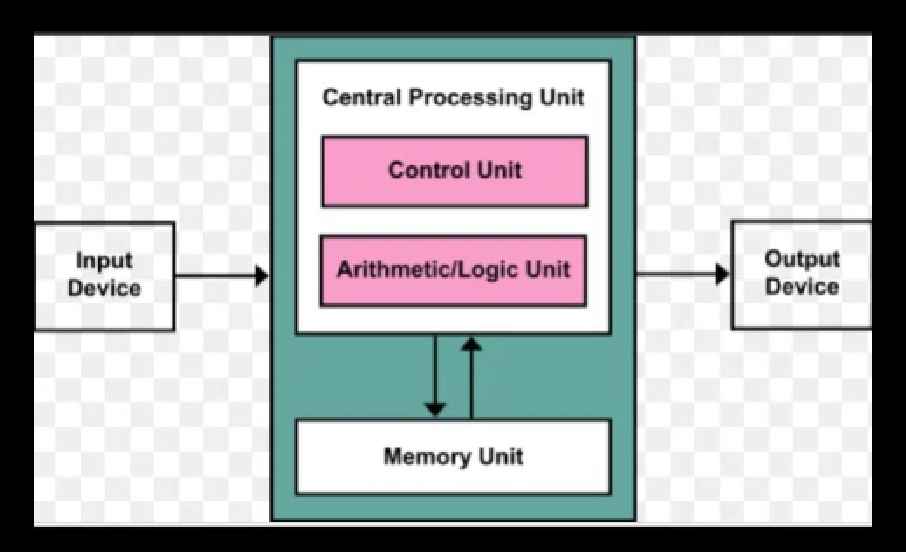
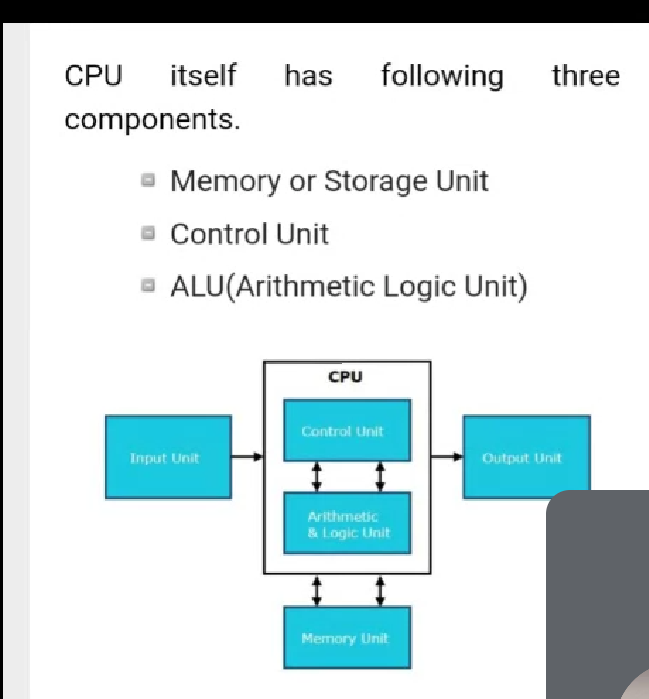
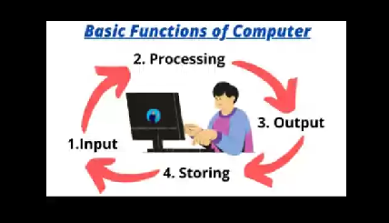
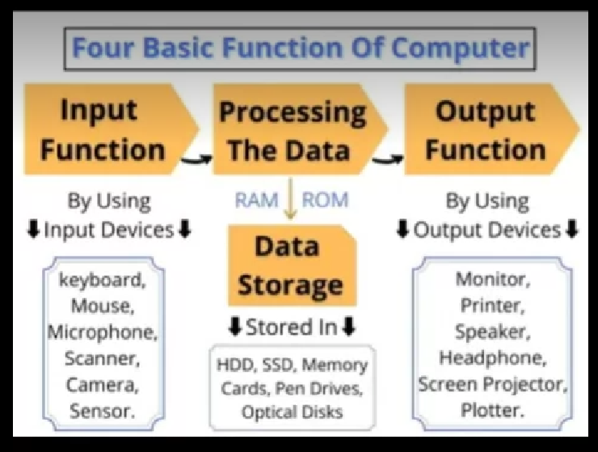
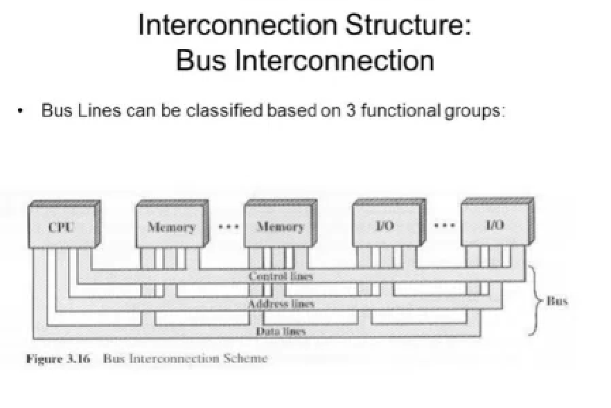
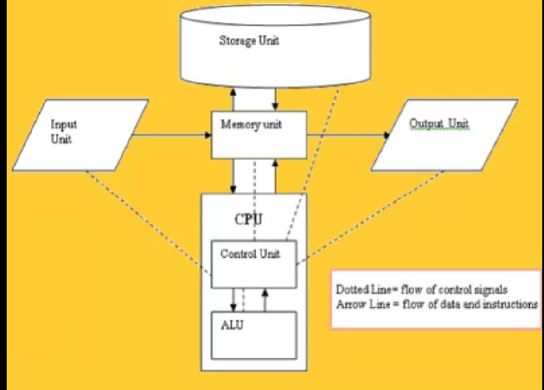
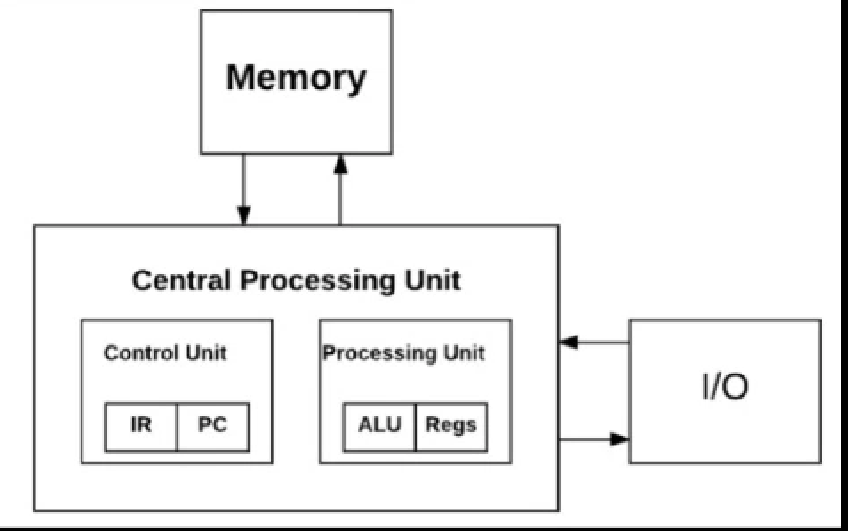

# Unit 1 - Introduction to Computer Organization and Architecture

### What is Computer Organization and Architecture(CAO)?
CAO is a study of computer system, it's internal working and usage of the system. Such a concept study is termed as CAO.

### CAO
Structure and functions-
CPU stands for Central processing unit, it will accept the input and produces the output. 

The inputs are taken from input devices, CPU will process the data and stores the content in MU, the op gets generated from the op device such type of the concept of termed as cpu working.

### CPU
- it is considered as brain of the computer
- it performs all type of data operations
- it can store data, perform various operation 
- it controls each and every mechanism related to the working of CPU therefore this is the main working of CPU

CPU consists of these components 
1. Memory Unit
2. Control Unit
3. Arithmetic Logic Unit

#### These three components are termed as initial components
### 1) Memory Unit
  - it can store the data, instruction and any other material continuously into a single unit that is known as memory unit.
  - It is also known as Ram memory or main memory
  - it performs the operation like
  - it stores data and instruction
  - it stores reports
  - it can store data is input and op devices
  - it can store the final result of the program

### 2)Control Unit
  - this unit will control of the operation of the entire computer such a unit is termed as Control Unit.
#### Functions-
- it performs data transfer
- it manages the computer part
- it handles all the operation
- it manages i/o devices
- it does not store any data

The full form of ALU is Arithmetic Logic Unit
There are two sections
- Arithmethic and logic section
- arithmethic performs ASMD operations such concept is followed is termed as arithmetic operations in alu
- logic section comparing, matching, merging, selecting followed in case of alu
- these type of Central processing unit is one of the concept which is used to perform the operation of the CPU

**Date(30/11/21)**

Computer functions and interconnection

Diagrammatic representation of basics functions of computer are as follows-
- Input- Inputs are passed to the computer. The input will get processed that means performing some operations on the input.
- processing
- output- The output is detected
- storing- The output gets stored
Theses type of operations are used in computer system.

*Working* - The initial working process is a follows

1) The input can be sent from any input devices like keyboard mouse mic etc.
2) The operation of processing gets start and after this processing gets done we have to store the data by using RAM memory or ROM memory and the data gets stored into the memory device aa
3) The op of the processing is sent to the op device and on the basis of it the op gets printed therefore it is termed as op projection
4) in this way the working of computer takes place

Interconnection-when the devices of the comp are connected together then such a concept is termed as interconnection. It generally takes place in between three devices that are CPU, Memory and I/O

The operation of it gets done by using communication lines, those comm lines is termed as Bus. There are three types of buses
1) Data Bus(Data Lines) - It is a type of bus or the connection line which is used to pass the data from one comp to another therefore such type of the lines is termed as data bus.
2) Address Bus - It is used to send the address the from one comp to another such type of connectivity line is termed as address bus
3) Control Bus - these are the types of connectivity line which are used to control all the component of the computer.

Fundamentals unit of the computer
The fundamental units of computer are of 5 types
- Input Unit
- Storage Unit
- Memory unit
- CPU
- Output unit

These 5 unit are very much important in order to perform the operation of computer system

**Date(1/12/21)**
The working of fundamental unit is as follow
1) input unit will send the input to memory unit
2) MU will store the entire data inside the storage unit
3) storage Unit stores the content combinly inside a block
4) mu will send the data for operation the CPU
5) CPU will perform all the operation with the help of CU
6) CU will decide the operation and perform it accordingly by using ALU.
7) after calculating the op it will be sent to the mu
8) mu will transfer the op to the output unit and thus the op is derived

### *COMPUTER ORGANIZATION*
As there are total 5 basic concept but the major component of the computer organization is CU.
-CU acts as a manager which handles and manages the each and every components therefore the CU will handle all the operation. And if any unit is showing any problem then it's the responsibility of CU to solve it and make the error free structure.
-CU will provide all the duties of the computer organization that means sending the ip data to the input unit, checking the work of alu and detecting whether the op is perfectly done or not, the storage is available in memory unit or not is checked and op is being displayed in a proper manner or not is displayed therefore the key component of computer organization is CU.
-if the operation of CU properly done then only the input will send the data to the memory performs the proper ALU operation and detecting the op at last this type of working is followed in the CO.

### *COMPUTER ARCHITECTURE*

Firstly the ip is sent to the CPU then the CPU consist of two basic unit like 
1) Control Unit- Manages all the operation thoroughly it consists of two parameters i.e. IR which is used for handling the list of components to be performed and PC that is program counter is used to calculate the work done prices therefore such type of the concept comes under control unit.
IR- Instructions/increment register
PC- program counter

2) Processing Unit - Consists of the component to be used in order for performing the Operation. ALU is responsible for all the arithmetic or logic operation and registers consist of the space to perform the operation, the output is driven and stored inside the memory for the further use and the copy of op is sent to the output device in order to perform the operation therefore such type of the mechanism comes under CA. Therefore these components are combinly used to learn the COA concept.

Reports - collection of files in a memory
