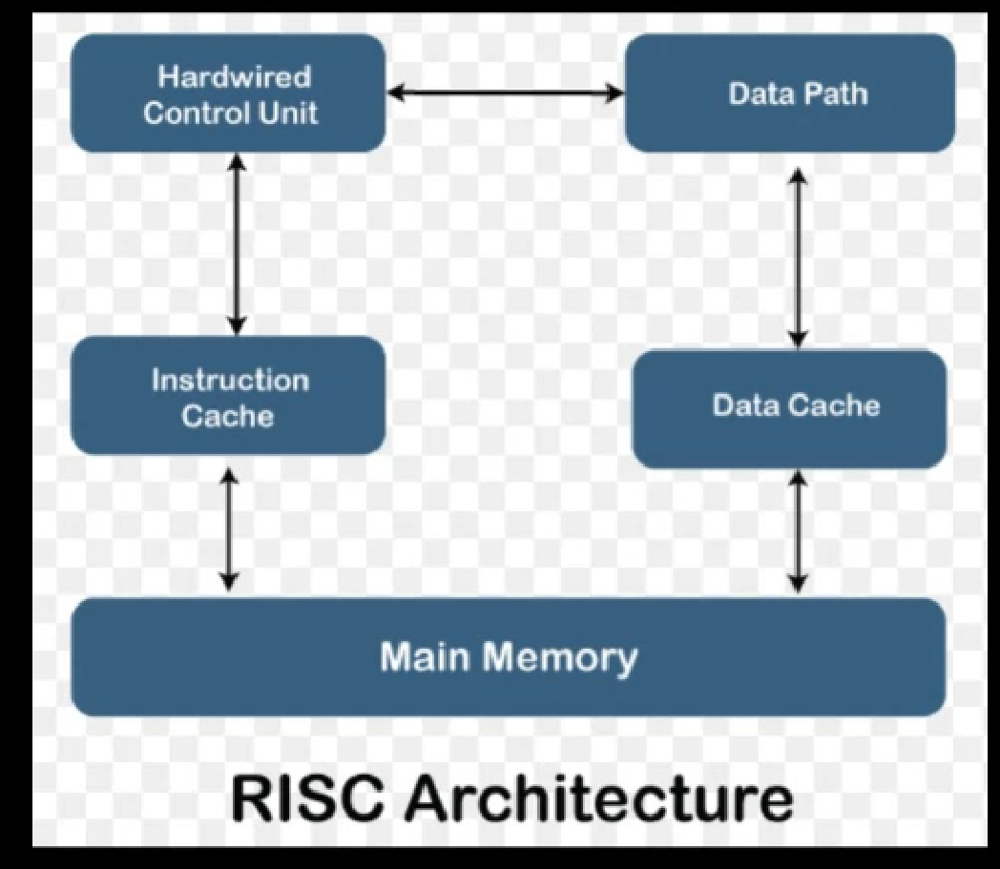

# Unit 2 - Instruction Set

### *RISC (Reduced instruction set computer) architecture*

RISC stands for Reduced instruction set computer this type of architecture of used to process the instruction set, this are the parts of work to be performed in order to process the entire work. Therefore for handling this entire architecture of the computer process is done by the instruction set.

There are 5 parameters for RISC architecture that are
1) Hard-wired Control Unit - Firstly the control unit will send the combine instruction set to the data path.
2) Data path - This will process the instruction set further. Data path will send the instruction set to the data cache.
3) Data cache - This will cross check the errors and if the error occurs then it will sort out the error and make the instruction error free, then the data cache will send the data to the main memory and the data gets stored.
4) Main Memory - Now the data from main memory will get transferred to the instruction cache.
5) Instruction cache - It is the particular arrangement which is used to keep all the instructiona in a particular unit, then the completion of the process is remarked to the control unit. In this way RISC architecture takes place.

### CISC (Complex Instruction Set Computer)  architecture

This architecture can handle one instruction at a one single time therefore there are 5 types of block which performs the operation on CISC.

1) Micro program control unit - Firstly the micro program control unit will store the entire instruction inside a particular block structure.One instruction gets taken out and sent to the control unit.
2) Control Unit - this will take out the instruction and start the processing on it. The instruction then sent to the data path. 
3) Instruction data path - This will create the separate way for the instruction. And then sends the instruction to the cache.
4) Cache - This will cross check the instruction and checks the error from it, if the error has been occurred then the errors gets stored out throw it to the outside firm, therefore the entire instruction will make it error free code by the cache block and the output is sent to the main memory.
5) Main Memory - it is the particular block which stores the output and reside it. Therefore after the execution of first block gets completed then the second instruction will follow same path. This cycle will go on repeating until the entire operation of all the instruction is executed.
This is one of the architecture in the field of CAO.

*Date (03/12/2021)*

Instruction set
It is a group of commands which has been passed to perform operations realted to the computer therefore such type of commands are known as  instruction set.
-Instrcution set can perform any type of operation according to the cpu. Therefore CPU is one of the major parameter to perform the operation of the computer.
-It performs operations like read, write, move, heandle the devices as well as handle the software and hardware part therefore such type of the concept which follows the command is termed as instruction set.

Charactersitics of instruction set
It stands for the speciality that instruction set contains.
1) Complete - complete stands for existing all data therefore instruction set which contains thsi command is totally complete it does not consists half filled data thus it is termed as complete.
2) Efficient - It means the usefulness in code generation for the programming concept and for handling the project.
3) Regular - it stands for availability whenever we require any data then instruction set will already consists of that data. In this way we can say that instruction set is regular. 
4) Compatibility - it stands for adjustible, the instruction act can adjust in any machine or in any device theorfore we can state that Instrution set is compatible.
5) Primitive - instruction set com perform all the basic operation like addition, subtraction, multiplication, division etc. Therefore this operation are termed as primitive operations.
6) Simple - it means that it's easy to understand and learn because of it's simplicity, any user can understand the concept very easily. Therefore it is considered as simple.
7) Smaller - Smaller means the length of the code is short which means there's no need to perform huge operations. Therefore it is termed as smaller in size.

### Types of operand in instruction set
Operands are the one on which the operation is performed. Some of the operands are as follows
1) Addresses: Addresses are the locations in memory of specified data. Here some calculations must be performed on the operand reference in an instruction, which is to determine the physical address of an instruction.

2) Number - Computers support numeric data and the common types of numeric data are integer of fixed point numbers and the other is floating point numbers.
3) Character - it will give alphabetical value ranging from A to Z. And it performs the operation on the basis of ASCII value.
4) Logical Data - The data which is represented in the form of logical one and zero or in the bit format say 1 or 0 or in boolean format say true or false is called logical data.

The representation of format is as follows

Instruction format is the particular structure to join to write the instructions in the proper structure there are three types of parameter in instruction format.
1) opcode- these are the particular symbols which are used
Therefore such type of the symbol are known as the opcode
2) Mode - it is a type of purpose with the help of which we can find the operation. There are 3 types of mode
- Read mode: it is used to read the instruction format .
- Write mode: It is used to write the code in a particular structure.
3) Address or operand: Operand are the one on which the actual Operation gets performed. Sometimes this operands are stored at some address this it is called as address operand.

### Types of instruction

Instruction is the main part of the computer system because it manages and handle all the operations of the computer therefore such type of component is termed as instruction.
There are four types of instruction
1) Data processing instruction there are two types of operation which gets performed
- arithmetic operations - ye consist of all the arithmetic operations like +,-,x,/ ab de it also performs the operation in logical manner like >,<,≥,≤ etc. Such process are data processing instruction operation. 
2) Data storage - with the help of data storage the data gets stored into register and the memory also such type of instruction is termed as data storage instruction. 
3) Data movement- We can move the data from one place to another.
4) program flow control- we can represent the flow chart for giving the instruction flow therefore with the help of this pattern we can represent the flow diagram in a very easy manner this instruction type can handle bulk of data in easiest way.

### Addressing mode
The techniques to specify the data in the instruction is known as Addressing Modes (AM). In computer architecture, there are different ways to retrieve the data in the instruction.
There are five types of addressing modes which are as follows:
1) Immediate addressing mode - Every instruction consist of two parts that is opcode and operand. Opcode stands for symbol like +,-/ and operand stand for variable. Therefore whenever we apply the direct instruction to which we have to perform the operation then such type of addressing mode is termed as immediate addressing mode where the instruction is given in a direct manner. 

2) Direct addressing mode - In this case the address specifies where our operand is stored inside the memory therefore such type of direct address given is termed as direct addressing mode. 

3) Register direct addressing mode - In this case the operand are hossen behind the register therefore whenever we look into the register it refers to the operand which is placed inside register set. Therefore such type of the addressing mode is termed as register direct addressing mode

4) Register indirect addressing mode - in this case we've the register number in place of operand therefore whenever we click on the register number at that time our cursor redirects us to the memory address which is inside of the registers. Therefore whenever we click on memory address at that time we can directly move on to the operand where the exact instruction variable is stored such type of the addressing mode is termed as register indirect addressing mode

5) implied addressing mode - in this the operand is placed inside the opcode, therefore such type of the addressing mode is termed as implied addressing mode, where the opcode self consists the operands.

### Instruction execution

The execution of instruction set is as follows
1) firstly all the instruction are combined together and placed at the start step when the instruction is send to the fetch instruction at that time the opcode and operand is detected.
2) fetch instruction will send the instruction to the decode instruction, the decode instruction will take out the numbers from the operand, afterwards the decode Instruction is sent to the execution step. This cycle repeats until the operation gets takes place, when the execution is completed entirely at that time the entire instruction set will get halt. In this way the instruction gets executed.

*Date(07/12/2021)*

### Assembly Language* 

Assembly language are the low level languages that means the language which uses symbols and labels such type of the language is termed as assembly language there are 2 parts of assembly language that is Instructions and*addresses*
Instruction stands for the work to be done and addresses gives us the value on which we are going to perform the operation. 
The are four types of component 
1. Values - it may be the constants or the expression.
2. Symbols - these are the symbolic representation which we can use for performing the operation such type of component is termed as symbol.
3. Labels - they are the addresses on which we can perform the operation therefore such type of address locations are known as labels.
4. Macros - these are the short definition to be provided for performing the operation.
There are three components of macros
- Instruction are the commands through which we can perform the operation.
- Pseudo instructions are the simple code which is used in order to place the working process
- Raw data is the collection of information which gets combined together. 
We cannot make use of '.' (dot) symbol in order to perform the operation therefore such type of the parameter is termed as assembly languages.

### Machine State 

The diagrammatic representation of machine state is as follows
Machine State is a particular state of showing our computer, whether it is in a on state or off state therefore such type of these status knowing concept of the computer system is termed as machine State. In this concept buttonPressed() function is used in order to turn on/off our computer. Therefore such type of the notation of the computer through this button it is known as Machine State.

**Date(08/12/2021)**

### Processor Status 
The operation of processsor status is something which describes fully the condition of a processor at each instant. It indicates which classes of operations are allowed and which are forbidden, and the status of all interrupts associated with the processor.

Maninly there are 5 status flags which are as follows:
1) Negative N - when this flag value is 1 it indicates that the result of the operation is negative.
2) Zero flag Z - the zero flag is set to 1 when the result of an arithmetic operation is zero.
3) Carry Flag C - Indicates when a bit of the result is to be carried to or borrowed from another byte. Also used for rotate and shift operations.
4) Overflow flag V - Indicates that a result of an signed arithmetic operation exceeds the signed value range.
5) Sticky Overflow Q - a sticky version of overflow created by instructions that generate multiple results.

### Types of operation
There are 6 type of operations in instruction set
1) Arithmetic operation - With the help of this all the arithmetic operation gets perform like +,-,x,/ ADD,SUB,MUL,DIV and operation like greater than or less than etc.
2) Logical Operation - The instrcutions used to perform logical operation like AND, OR, XOR.
3) Data transfer - The most fundamental type of machine instruction is the data transfer instruction. If both source and destination are registers, then the CPU simply causes data to be transferred from one register to another this is an operation internal to the CPU.
4) System control - Instructions to change the program execution sequence or to control the flow of operation execution.
5) I/O operation - Transfer data from one specified i/o port or device to destination.
6) Conversion - Conversion instructions are those that change the format or operate on the format of data. An example is converting from decimal to binary.
7) Transfer of control - The instructions in any program have some of their functions changing the sequence of instruction execution. these instructions are conditional and unconditional branching operations.

**Date(09/12/2021)**

### Structure of program in instruction set

The general structure of writing the instruction set program depends upon the 4 parameters
1) Opcode - it stands for the symbol of the operator with the help of which we can perform the operation therefore the symbol which is used in order to provide operations in arithmetic manner. Therefore such type of the symbol which is used is termed as opcode.

2) Address1 - it is a particular type of input parameter which is used to send the source data, therefore we can say that Address1 is the basic address of the sender location computer. Therefore it is termed as source address also.

3) Address2 - it is the address of the destination location which is used to retrieve the final output. Here Address2 is also known as secondary address which is used to store the outputted data. Therefore such type of the next address is termed as final detected address result.

4) Operand - it is the variable names which are used to perform any type of operation. Therefore operation is one of the parameter which is only done by the Operand.
Operand can be immediate value, direct value as well as the register value also. Therefore such type of parameter is termed as Operand.

