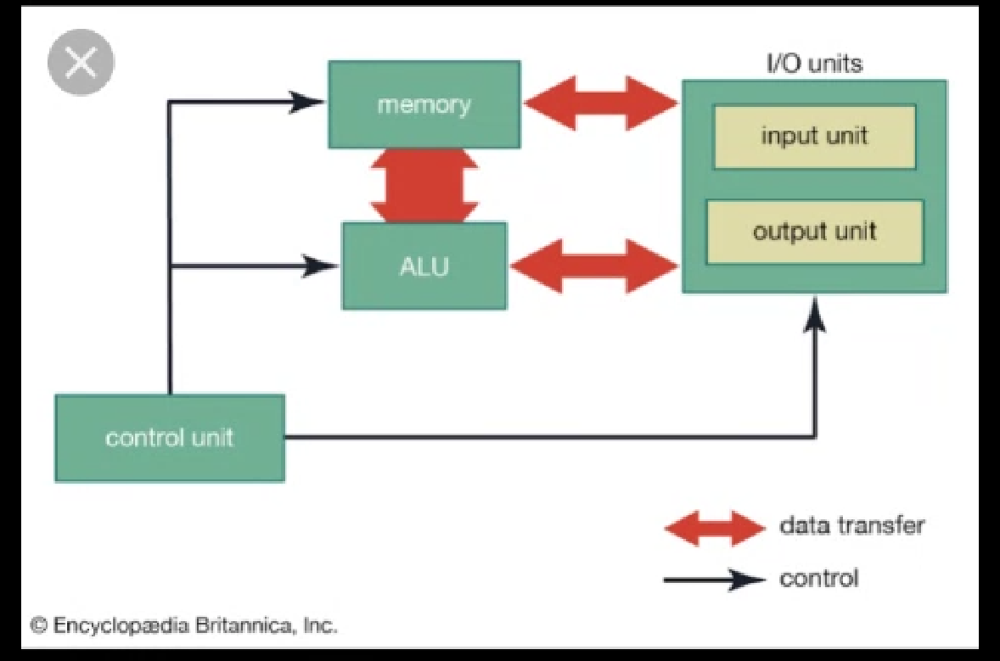
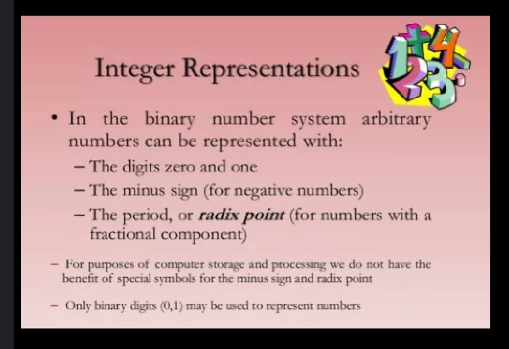
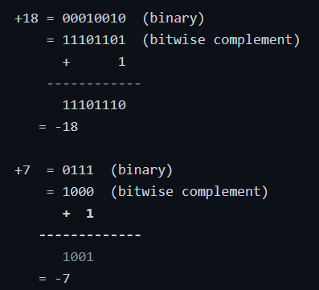
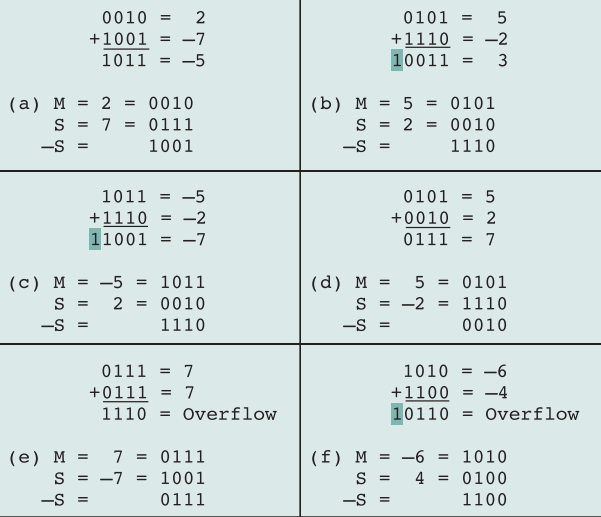

# Unit 3 - Computer Arithmetic

## ALU 
ALU is one of the important part where the operation of the computer system is majorly performed. It performs Arithmetic and logical operations on data. 

In Arithmetic the operations like addition, subtraction, multiplication and division and the unit which performs such operations is called Arithmetic unit whereas logical unit performs greater than less than equal to and Boolean logic operations. This such type of operation is termed as logical operation unit.

The diagrammatic representation of ALU is as follows

Control unit is the manager of the entire structure of arithmetic and logic unit, it can perform the operation on the basis of three parameters that is

1) Memory

2) ALU

3) I/O unit

If the memory is available for performing the desired task then the Input Unit will send the data to the memory with the help of it all the input can occupy the memory and then it is passed to ALU. After the operation is performed the result will be sent to output unit, this cycle repeats until the entire output isn't detected of the instruction set. Therefore such type of unit is called ALU. 

**Date(10/12/21)**

## Integer Representation

Wherever we want to represent our perform the operation at that time you'll have to use the integer representation when the integer representation we want to use at that time we have to make use of binary numbers. Here there are two types of numbers which are used those are 0 & 1. Here 0 & 1 are understandable buy the system, and no other representation is used for the computer system.

There are two types of signs are used which are minus(-) and plus(+). Minus indicates negative numbers whereas plus indicates positive numbers.

Fractional component is not used in the integer arithmetic therefore we just have to use only the converted decimal point numbers.

The point is also called as radix. And the digit which is obtained is called binary.

This type of mechanism is basically used to perform the integer arithmetic and all the binary operations which get perfomed with the help of integers. 

### Integer arithmetic

In order to perform the operation of integer arithmetic then it gets followed on the certain rules and regulation.

1. when we perform the addition of two integer numbers then the result which we obtain is also an integer.

- int + int = int

2. Whenever we perform the subtraction of two integer numbers then we will get the required answer in the form of integer.

- int - int = int

3. whenever we perform the multiplication of two integer numbers at that time the result will be in the form of integer itself.

- int × int = int

4. wherever we perform the division of integer at that time we will get the final result as integer only. Here no fractional component are used. Therefore we will get only integer value as the main parameter. Therefore this type of rules are very important in order to get the proper arithmetic result. Thus we have to use these rules in order to get the proper required result. 

### 2s complemnet
Calculation - Take the Boolean complement of each bit of the corresponding positive number, then add 1 to the resulting bit pattern viewed as an unsigned integer.

   

[Readmore about integer arithmetic](https://pages.tacc.utexas.edu/~eijkhout/istc/html/arithmetic.html)

### Parameters for operation

- Arithmetic operations gets performed with the help of 3 bits. Here **0** is represented as **000** and **1** is represented as **001** in a 3 bit format. This representation is mostly used to in order to get the proper result and the proper content. All types of arithmetic operation gets performed with the help of 3bit format in CAO. There this contents are considered as arithmetic content

**Date(11/12/2021)**

### Floating Point Representation

- Floating point numbers are also termed as decimal point numbers which are used to place point related data inside it. Therefore such type of the numbers are termed as floating point numbers.
- We can perform all the arithmetic operations with the help of floating point numbers. The operation are addition, subtraction, multiplication and division. These operations can be done directly with the floating point numbers. 
- The number whcih comes after the decimal point is termed as arbitrary number. Therfore let us take one example of 
**- 0.5 x 0.25 = 0.125** -> the number which we obtained after the point i.e. .125 is called as arbitrary number.

1. Let us see some rules regarding floatin point representation.
2. - by considering the number of zeros before decimal point we have to place the number belonging to zero at power contained. Thereore it is termed as decimal conversion when the number is not specified after the arbitrary point with the zero contained. 
3. - When the conversion takes place at that time we will turn the number into decimal point by specifying the point after the number. 
4. **- 0.125 => 1.25 x 10^-1**
5. - whenever we have a large number, in order to convert that number we have to see the number of zeroes allocated with the point number and wer have to place the number at the power of 10, by considering zeros
6. **- 5000000 => 5.0 x 10^6**
- EX:
- **0.1245 => 1.245 x 10^-1**
- **Q. Convert 0.3329 into the decimal number of 2 digits**
- 0.3329 => 33.29 x 10^-2
- **Q. Convert 1.6629 into three digit decimal number**
- 1.6629=> 166.29 x 10^-2
- **Q. Convert 1.1114 into decimal having 4 digits**
- 1.1114= 1111.4 x 10^-3
- **Q. Convert into 4 digit decimal**
- 10.1010 = 1010.10 x 10^-2
- **Q. Convert 5624.5624 into 7 digit decimal number**
- 5624.5624 => 5624562.4 x 10^-3
- **Q. Convert 59.0000 into 6 digit decimal**
- 59 x 10^4

### Examples on arithmetic 
- 0.2 x 0.8 = 0.16 // 0.16 is a number which gives .16 as arbitrary value.
- 0.4 x 1.86 = 0.744 // 0.744 is our arbitrary value.
- 2.87 x 0.12 = 0.3444 // 
- Perform the addition of 1.245 and 1.234 and state the arbitrary value.
- 1.245 x 1.234 = 2.479 //here 0.479 is our arbitrary value
