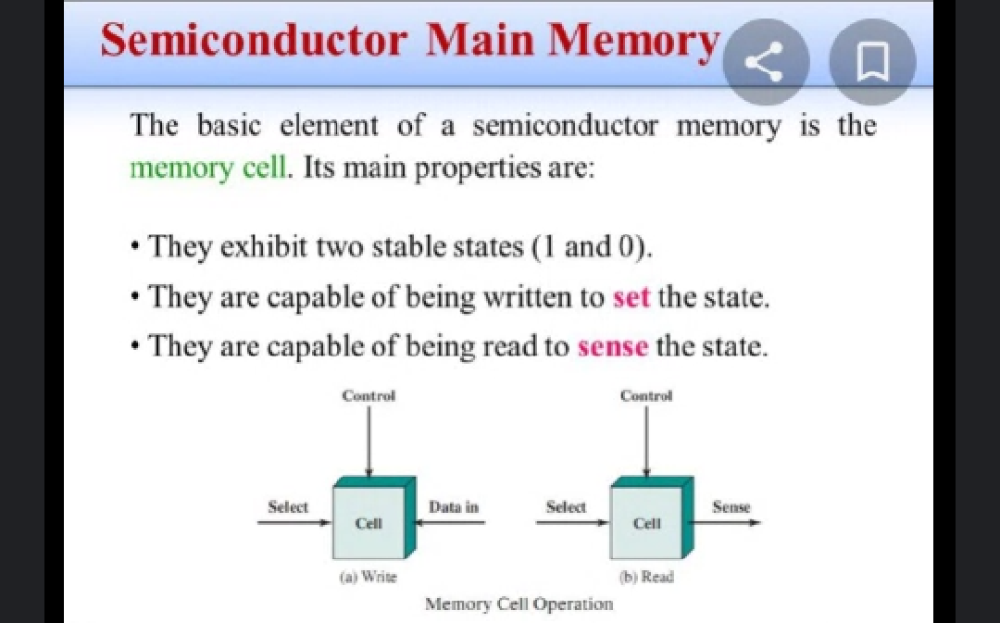
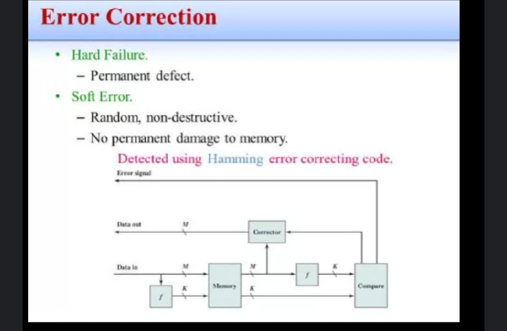
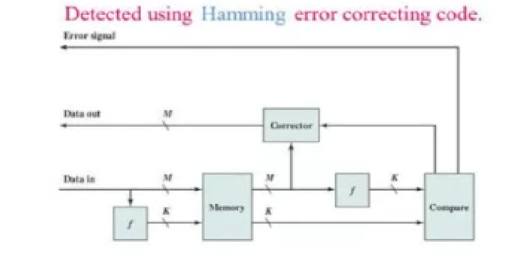
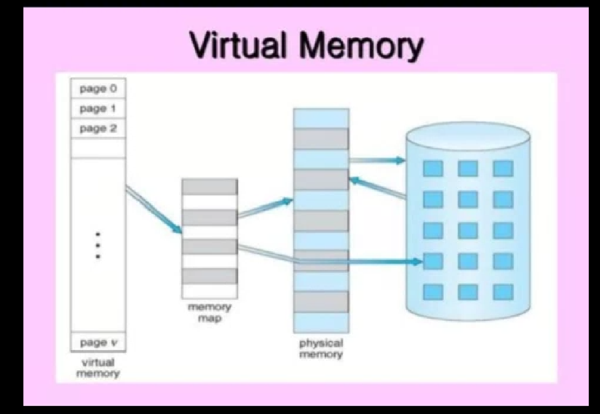
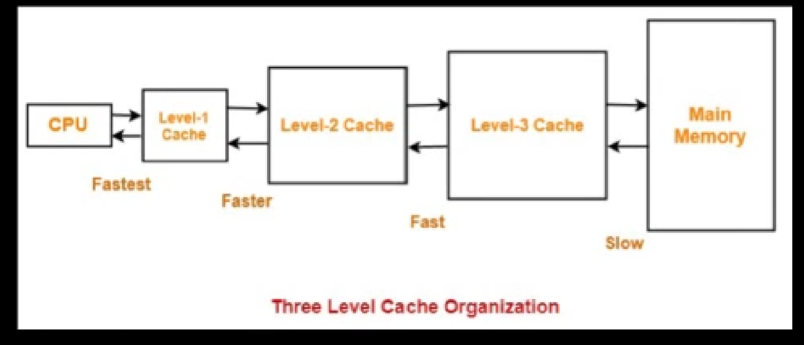
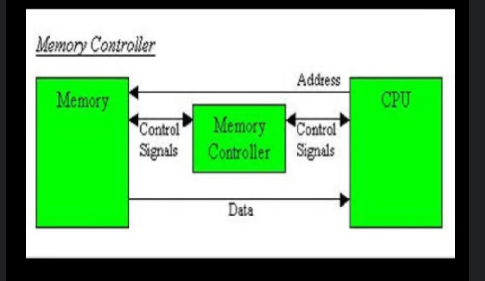
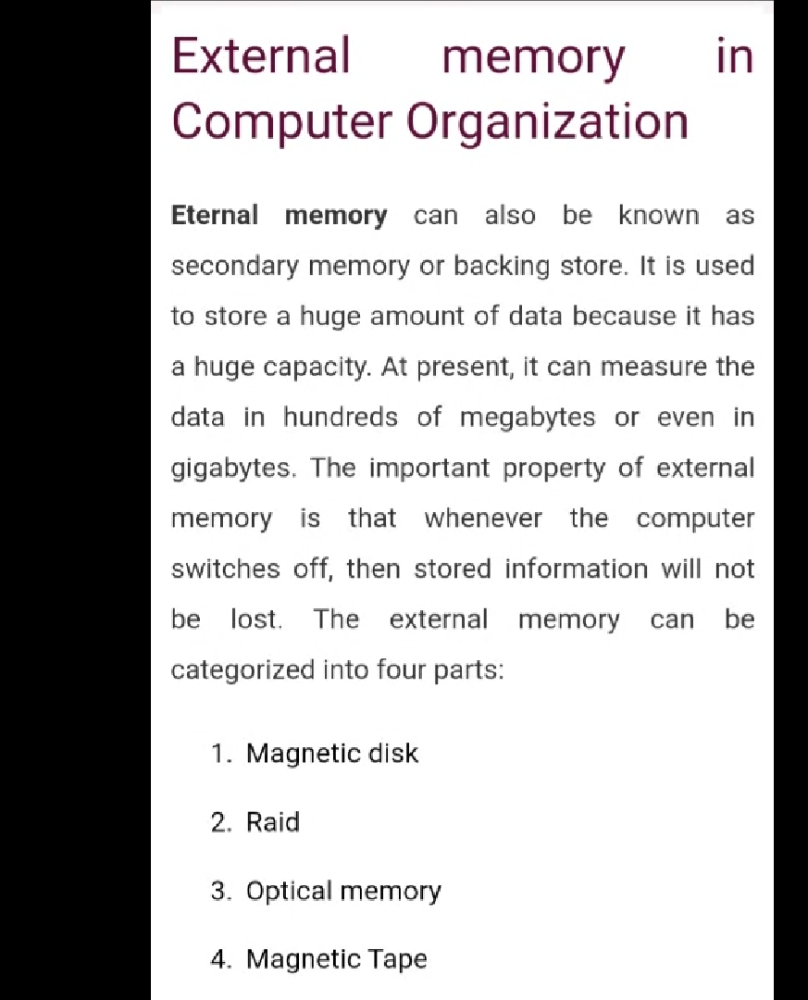

# Unit 4 - Semiconductor Main Memory 
### **Introduction** 
In this topic we're going to learn how the operation of main memory with the help of semiconductor takes place. Therefore for performing such kind of memory cell plays an important role as all the operation related to the Semiconductor main memory gets performed with the help of cell only. We can't perform any type of operation without the help of memory cell.

In this case there are two states for

State 1 is termed as the on state and state 0 is considered as the off state.

Semiconductor main memory can perform the operation of two types that is read operation and write operation.

For performing the write and read operation we have to follow these two diagrams.

1. Write operation

- While performing the write operation we first have to select the data that we want to store inside the Semiconductor main memory.

- Afterwards the data will get stored in the cell and notification of the data is given to the control unit.

- if the control unit wants to store the data then it will give the permission to cell. Then, the data will get stored inside the Semiconductor main memory in order to perform the write operation.

2. Read operation

- Firstly we will the send the data that we want to retrieve to the cell therefore the data will get stored inside the cell, cell will inform about the data to the control unit.

-  Afterwards the control unit give permission to the cell then only the data will get retrieved to the user by the Semiconductor main memory. In this way the operation of semiconductor main memory takes place. 

*Note* - here the write operation is also termed as set in operation whereas read operation is termed as sense operation. In this way the semiconductor main memory works.

### Error correction

The diagramatic representation of error correction is as follows

In case of error correction there are two types of error which occurs.

1) Hard failure - It is a type of error which is permanent these errors cannot be resolved at any stage, therefore such type of errors which permanently damages the entire system and the error cannot be resolved are called as hard failure or permanent defect error.

2) Soft error - These errors are those type of errors which are random occurring errors therefore due to this non destructive error no permanent damage takes place to the memory. Therefore such type of the concept which causes normal error and doesn't result in any destruction are known as soft errors. And these are random and non destructive with error correction type of error.

*Error Correction* It is one of the very important step while resolving all types of error in the computer system. This is one of the best architectural view that every semiconductor main memory devices can construct in order to solve the problem. This concept is termed as error correction. 

**Date(14/12/2021)**

Error correcting code consists of 3 block that is 

1) Data input 

2) Data output

3) Error Signal

*Working*

Data input will send the data and function into the memory, the data can be directly sent to the memory but the function has to go through the function block and then only it get reached to the functional block which is placed inside the memory as memory block consists of both function and data. If there are any errors in the data at that time the error data is sent to the corrector in order to make the data error free. Therefore the error gets directly moves out from the data output zone, but the function which consist of error, it firstly has to go through the functional block in order to sort out the error and make the code free. Then the error free code will get sent to the compare block. When the compare block analyses the data then it can be possible that compare block finds the error containing code, therefore the compare block will throw the error outside of error signal zone. And the functions which are there in order to get compared such type of error free codes gets directly sent to the output deliver block. Therefore such type of the mechanism is termed as error correcting code. 

### Virtual and Cache memory

Virtual memory is not any real content and it cannot be seen by the naked eyes. Such type of memory which is not in a real manner is called virtual memory.

Firstly the user will send the request to the physical memory, physical memory will pass the request to the virtual memory then the virtual memory will give its feedback to the memory map therefore memory map will send the feedback to the physical memory, the physical memory will convey the message to the user. In this way the operation of virtual memory takes place. This operation is performed in both the cases, whether the response is yes or no.

**Date(15/12/2021)**

### Cache memory

Cache memory is a temporary memory which stores the data on temporary basis whenever main memory does not have enough space to store the data at that time cache memory is used.

Here the data gets stored inside the cache memory the data gets stored in the pattern of category stages. Therefore whenever we have the data of huge capacity at that time the data gets stored in Level 1 Cache but when the data is of medium range at that time it gets stored in Level2 Cache, but when the data is of very small capacity at that time it gets stored in Level3 Cache. Therefore types of content is very primary content to store it temporarily, there are two main access coordinator that is CPU and main memory whenever they want to access the data at that time they can make use of any type of data according to their choice in this way cache memory works.

**Date(16/12/2021)**

### Memory controller

The diagramatic representation of memory controller is as follows

- Memory Controller is the particular component which is used to handle all the mechanism in between the memory and the CPU. In short we can say that memory controller is the particular mediator component which handles all the operations related to CPU and the memory unit. Therefore such a component is termed as memory controller.

- The operations of memory and CPU gets done by using the control signals therefore control signals have the responsibility to manage and handle all the data and addresses at the particular zone. Therefore whenever we want to perform a new operation at that time we should have to know about the proper addresses related to the data. Therefore by using this we can easily detect the contents and handle all the operations where the data is appropriately stored. 

**Working of memory controller is as follows**

Firstly the data has been sent from memory to the CPU, CPU stores the data appropriately and send the actual address where the exact has been stored, therefore by using this technique we come to know the actual address of the data were the exact material gets stored. Arch type of the concept is termed as memory controller.

### External Memory in computer organization

**Organization and characteristics of Magnetic Disk**

The characteristics of Magnetic Disk is as follows

1. Fixed head disk

 - It consist of only one head that means it can perform read/write operation from the one end, it is mounted on a particular arm which can cover maximum distance at one go therefore it is termed as the movable head disk also. 

2. Movable head disk - as the magnetic disk can cover huge distance and it performs all the tracks therefore we can cover huge space

3. Non removable disk- As it is permanently mounted disk because it can not be changed once it is placed. Therefore such type of the permanent mounted track disk is termed as non removable disk because we can make the changes to it but we cannot remove it. 

Non-Removable disk -

When we want to remove the current disk at that we have to replace that disk with the another one.

Floppy disk and zip cartridge are the example of replaceable risk it can store unlimited amount of data and the disk can be moved from one computer system to another. These are the advantages of removable disk over non removable disks. 

Double sided disk - these type of disk can be used from both the sides, therefore this type of disks are termed as Magnetic disks.
